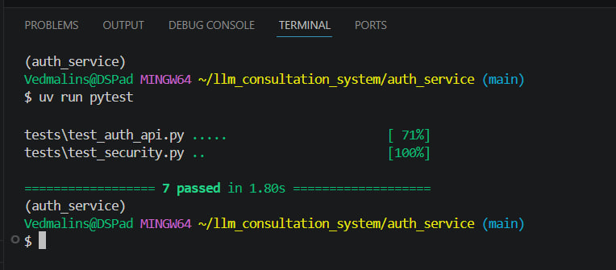
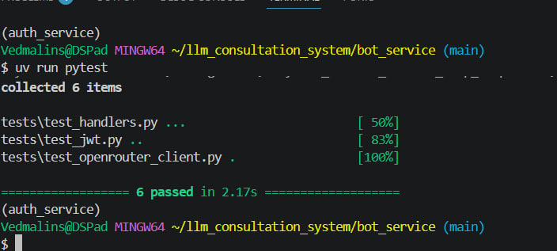
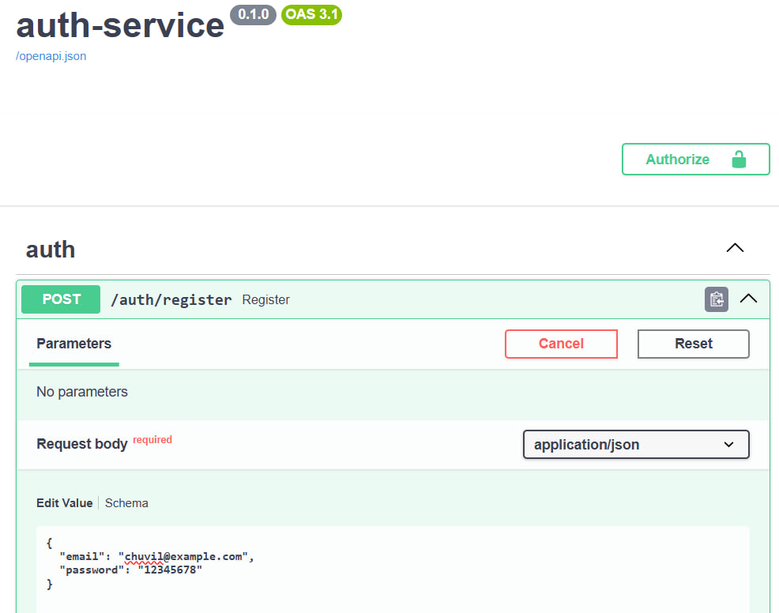
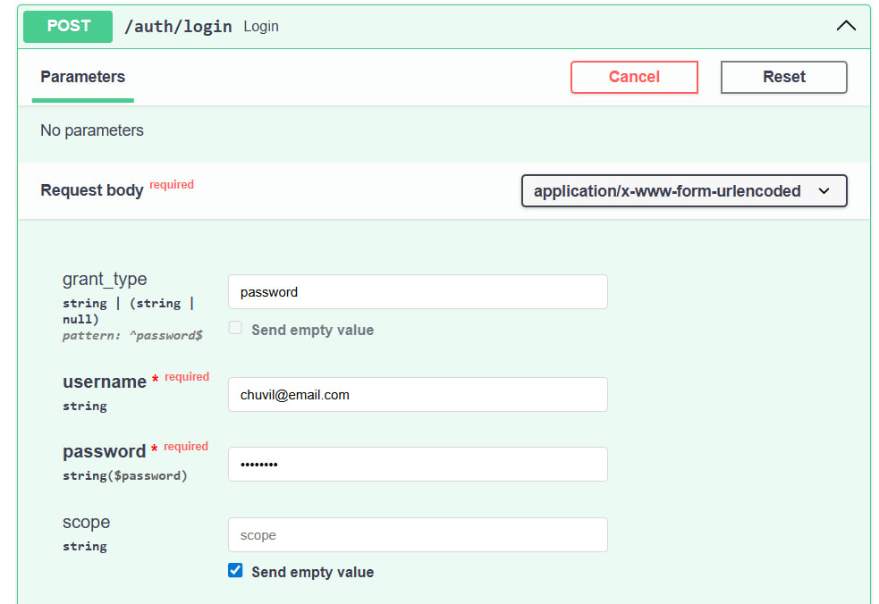
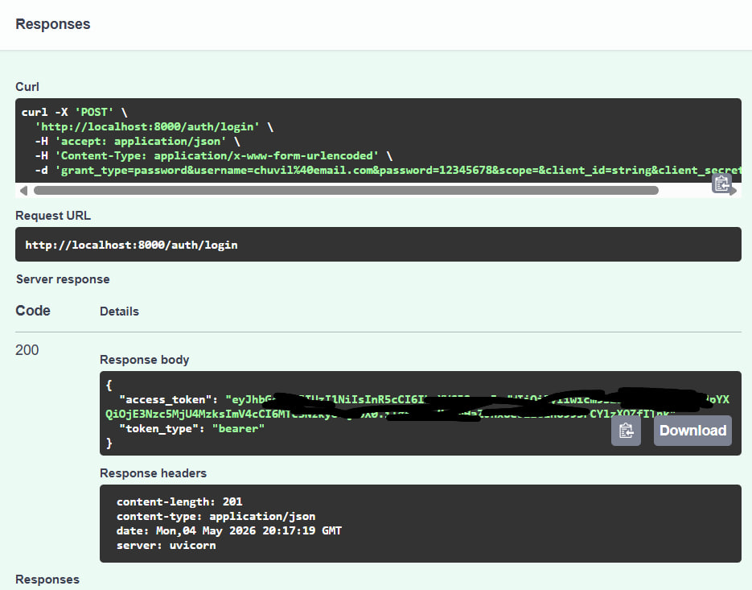
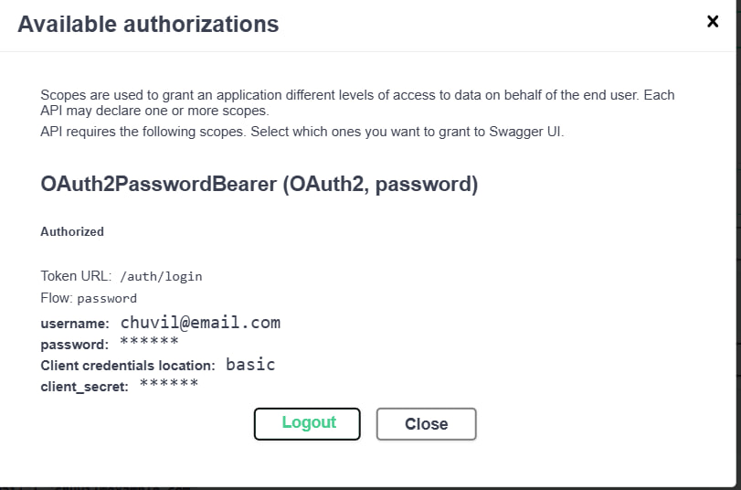
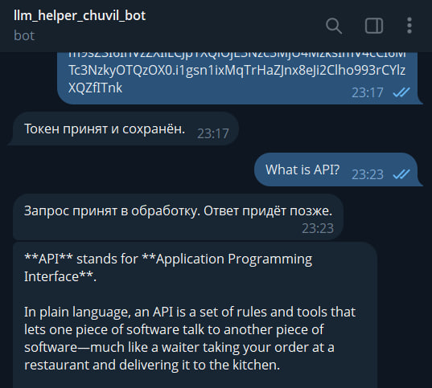
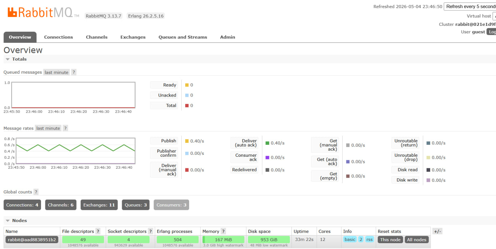

# LLM Consultation System

## Описание

Проект представляет собой двухсервисную систему LLM-консультаций:

- **Auth Service** — регистрация, логин, выдача JWT
- **Bot Service** — Telegram-бот с LLM через OpenRouter

Архитектура построена по принципу разделения ответственности:
- Auth Service работает с пользователями и токенами
- Bot Service не знает пользователей и доверяет только JWT

---

## Архитектура

```

User → Telegram Bot → Redis (JWT)
↓
RabbitMQ
↓
Celery Worker → OpenRouter → Ответ → Telegram

````

---

## Запуск проекта

```bash
docker compose up -d --build
````

---

## Auth Service

Swagger:

```
http://localhost:8000/docs
```

### Возможности:

* POST /auth/register
* POST /auth/login
* GET /auth/me

JWT содержит:

* sub (user id)
* role
* iat
* exp

---

## Bot Service

Функциональность:

1. Пользователь получает JWT в Auth Service
2. Передаёт его боту:

```
/token <jwt>
```

3. Отправляет запрос:

```
Что такое API?
```

4. Бот:

   * проверяет JWT
   * отправляет задачу в RabbitMQ
   * Celery вызывает OpenRouter
   * возвращает ответ

---

## Технологии

* FastAPI
* aiogram
* Celery
* RabbitMQ
* Redis
* OpenRouter
* Docker

---

## Тесты

Запуск:

```bash
cd bot_service
uv run pytest
```

```bash
cd auth_service
uv run pytest
```

Типы тестов:

* unit (JWT, security)
* integration (Auth API)
* mock (Redis, Celery, OpenRouter)

Скриншоты тестов:

### Auth Service



### Bot Service



---

## Скриншоты

### Auth Service

#### Регистрация


#### Логин


#### Получение токена


#### Проверка /me


---

### Telegram Bot

#### Ответ от LLM


---

### RabbitMQ

#### Очереди



---

## Соответствие требованиям

* Разделение сервисов ✔
* JWT только в Auth Service ✔
* Redis используется ✔
* RabbitMQ используется ✔
* Celery используется ✔
* LLM через очередь ✔
* Тесты ✔

---

## Автор

 Vedmalins (Chuvil Alina)

```